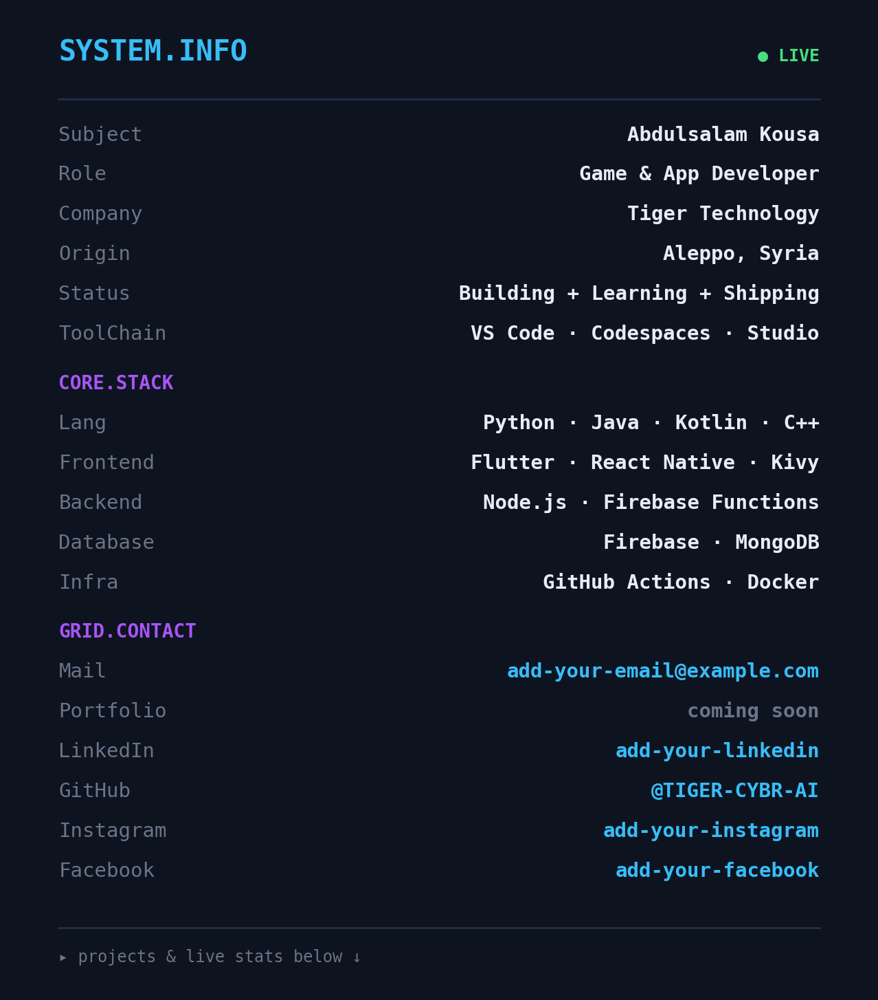
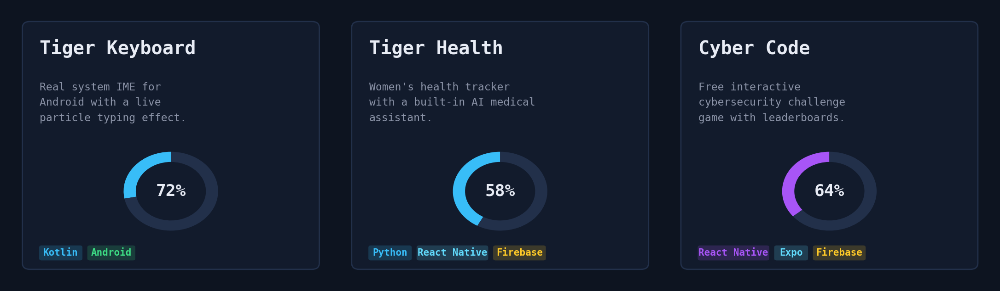

<table width="100%">
<tr>
<td width="260" align="center" valign="top">

</td>
<td valign="top">

</td>
</tr>
</table>

---

### LIVE.STATS

<!-- snake animation — see setup note below to activate -->

---

### PROJECTS.LIST

---

*More projects & updates coming soon* · **Tiger Technology**

